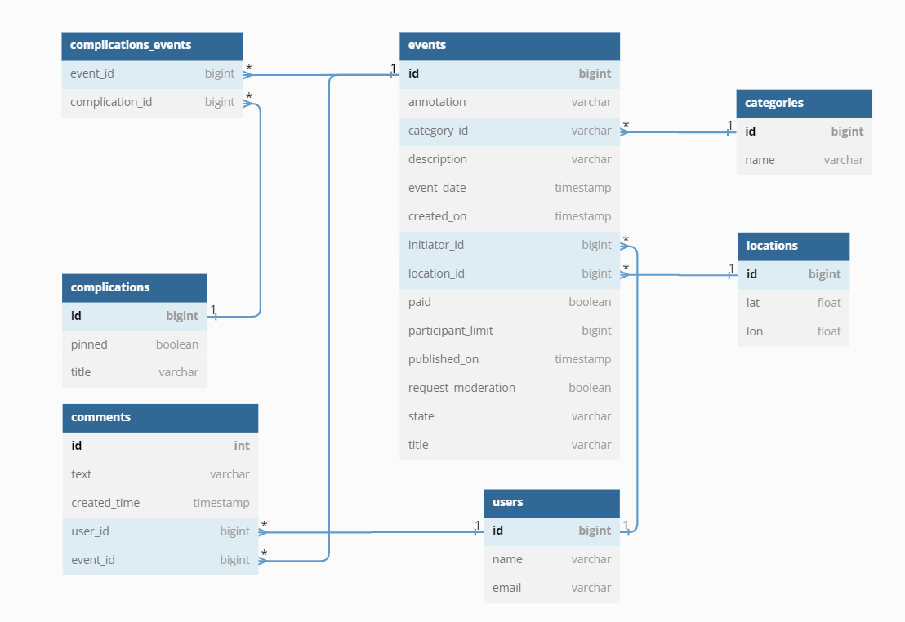

# *Java-explore-with-me*

[ссылка на pull request #1](https://github.com/Ruslan-Bulatovich/java-explore-with-me/pull/8#issuecomment-1612490208)

Описание проекта
-
Приложение представляет собой афишу, с помощью которой можно предложить какое-либо событие от выставки до похода в кино
и набрать компанию для участия в нём.

Использованные технологии:
-

- Java, Maven, Spring-Boot, Hibernate, Postgresql, Lombok, Docker-compose, RestTemplate

Функционал приложения:
-

1.  ### Проект реализован по микро-сервисной архитектуре:
    * main-svc - реализация основной бизнес-логики
    * stat-svc - сбор и хранение статистики по обращению к публичным эндпоинтам/выполнение различных воборок по
      анализу работы приложения

2.  ### У сервисной части приложения 3 слоя управления:

* #### Публичный:
    * Запросы на получение категорий событий
    * Запросы на получение подборок событий
    * Запросы на получение скоращенной информации конкретного события по id
    * Запросы на получение списка событий по заданным фильтрам
* #### Приватный:
    * Запросы на создание/обновление/отмену события
    * Запросы на получение своих событий
    * Запросы на создание заявки на участие в событие
    * Запросы на получение своих заявок на участие в событиях
    * Запросы на получение заявок на участие в собственном событии
    * Запросы на отмену заявки на участие в событии пользователем
    * Запросы на отклонение/подтверждение заявок на участие в событии владельцем события
    * Запросы на создание/изменение/удаление/получение комментариев
* #### Административный:
    * Запросы на создание/изменение/удаление категорий
    * Запросы на создание/удаление пользователей
    * Запросы на получение информации о пользователях
    * Запросы на создание/изменение/удаление/закрепление на главной странице подборок событий
    * Запросы на подтверждение/отклонение/изменение событий пользователей
    * Запросы на получение событий по заданным параметрам
    * Запросы на получение статистики по количеству публичных запросов
    * Запросы на изменение/удаление/получение/блокировку комментариев
    * Запросы на блокировку возможности создавать/редактировать комментарии к событиям пользователям

3.  Статистическая часть приложения предназначена для сбора информации о количестве обращений пользователей к спискам
    событий и о количестве запросов к подробной информации о событии. На основе этой информации
    должнаформироваться статистика о работе приложения.

4. ### Схема базы данных приложения:

